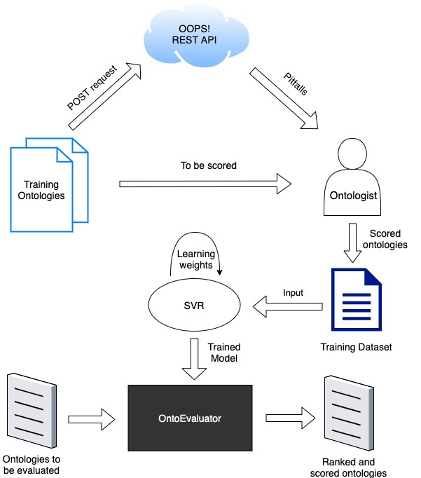

# OntoEvaluator

An [application](http://ontoevaluator.herokuapp.com/) to score and rank ontologies based on syntactic and semantic quality

## Using the web application

- The web application is hosted [here](http://ontoevaluator.herokuapp.com/)

- It offers two main features: training a model, and using that trained model to evaluate ontologies

- In the absence of a model, new users should select the "Train Model" option. 

- In the training process, ontologies can either be scored manually or through a semi-automatic scoring scheme that calculates the score as a weighted sum of the number of pitfalls present in the ontology, weighed by the pitfall importance (ie. minor, important or critical pitfall).

- The model can then be downloaded and used for evaluating ontologies in the future.

## Process

As shown in Figure 1, the working of OntoEvaluator can be explained as follows:

1.  First, OntoEvaluator takes a list of training ontologies as input and uses the OOPS! scanner to check for pitfalls. 

2. Then, the ontologist uses the scanned pitfalls to score the ontologies as per their need and discretion. 

3. The training dataset is then constructed by taking the count of detected pitfalls in each ontology as the feature vector, and the assigned score as the label. 

4. OntoEvaluator  trains an epsilon Support-Vector Regression (SVR) model on this dataset and the model learns the weights of each pitfall. 

5. We choose SVR for this purpose since we desire to use the assigned scores to learn the boundaries between ontologies containing pitfalls of various severity. 

6. In other words, depending on the scores assigned, OntoEvaluator learns to give higher weights to critical pitfalls (ie. pitfalls that drastically affect the score) and consequently, lesser weights to minor pitfalls. 

7. Thus on being given a list of ontologies as input, OntoEvaluator uses OOPS! to detect pitfalls and the weights from the trained model to output a pitfall score, which can then be used to rank ontologies accordingly. 
